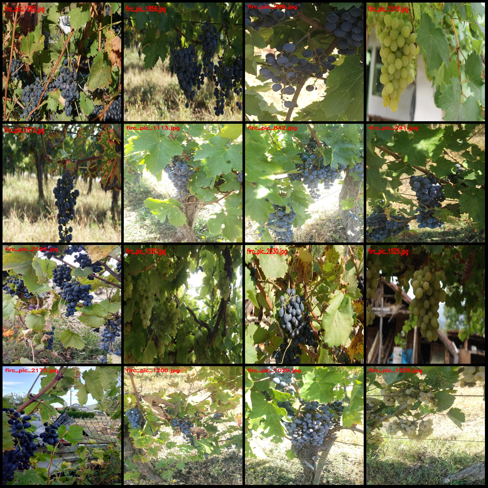
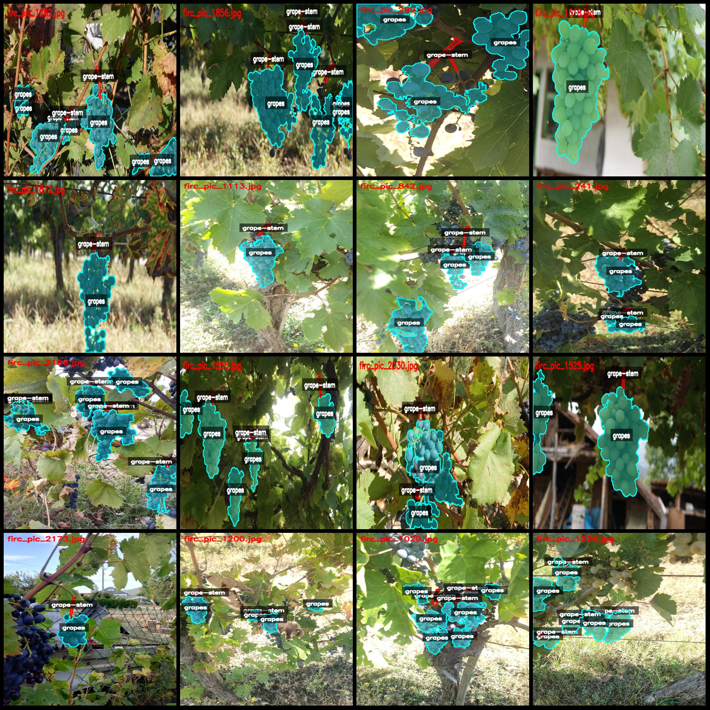
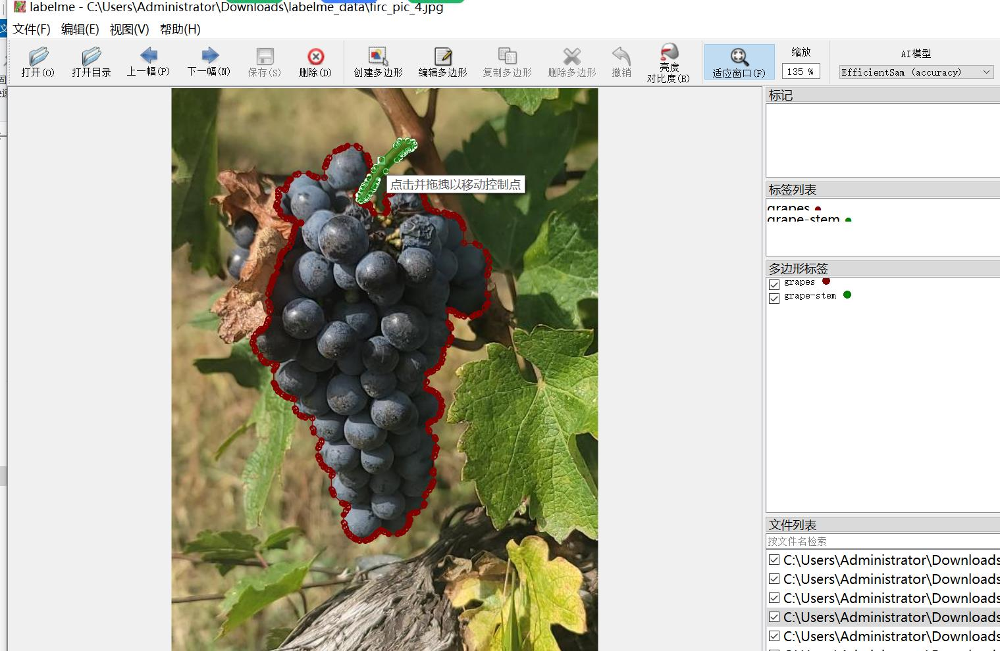

# Smart Orchard Grape Stem and Grapes Segmentation Dataset: LabelMe Format, 2225 Images in 2 Categories

Dataset format: LabelMe format (excluding mask files, only containing JPG images and corresponding JSON files)  
Number of JPG files: 2225  
Number of JSON files: 2225  
Number of categories: 2  
Category names for labeling: ["grape-stem", "grapes"]  
Number of boxes per category:  
- grape-stem (Grape Stem): 4652  
- grapes (Grapes): 6879  
Total number of boxes: 11531  
Labeling tool used: labelme v.5.5.0  
Image resolutions: Multiple resolution images, e.g., 481x640, 640x428 etc.  
Labeling rules: Polygons are drawn around the categories.  
Important note: The dataset can be opened and edited using LabelMe. JSON datasets need to be converted into masks or YOLOF/COCO format for semantic segmentation or instance segmentation.  
Special declaration: This dataset does not guarantee the accuracy of the trained models or weight files.  
Image previews:  
Examples of labeled images (choose 16 randomly from the dataset):  
Results of labeled drawings:  
An example of how to edit an image with LabelMe:

## Images

Here is a pay link on Stripe ( https://buy.stripe.com/3cs8yP7sY87d0vu9AB ). Please contact me lonlonago@foxmail.com after funding $89, and I will send you a complete data files , thank you!

